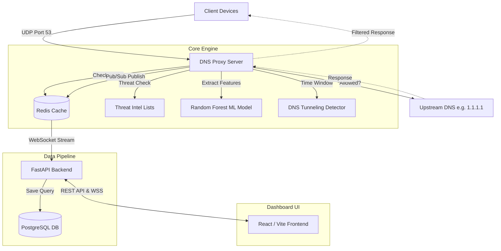

# SIH DNS Security Project 

DNS Filtering Service using Threat Intelligence and AI/ML.

## Architecture



## Tech Stack

| Component | Technology |
| --- | --- |
| Backend | Python 3.11, FastAPI, SQLAlchemy (Async) |
| Database | PostgreSQL, Redis |
| AI/ML | scikit-learn, XGBoost |
| DNS | dnslib, dnspython |
| Frontend | React / Next.js (Node.js) |
| Container | Docker, Docker Compose |

## Quick Start

```bash
docker-compose up --build
```

## Development Setup

### Backend
```bash
cd backend
python -m venv venv
source venv/bin/activate  # On Windows: venv\Scripts\activate
pip install -r requirements.txt
python -m app.main
```

### Frontend
```bash
cd frontend
npm install
npm run dev
```

## Project Structure
- `backend/`: FastAPI backend, ML models, and DNS server code.
- `frontend/`: React frontend for dashboard.
- `ml_training/`: Data and notebooks for model training.

## License
MIT
